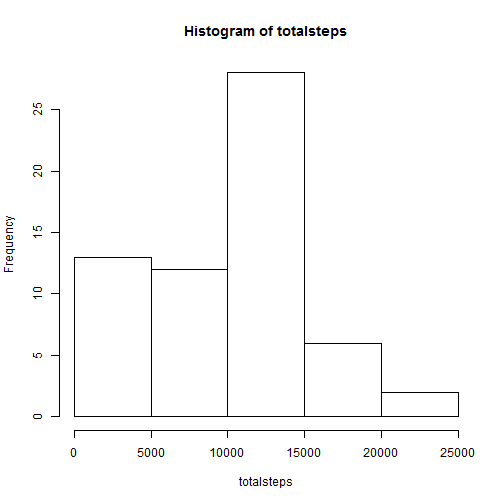
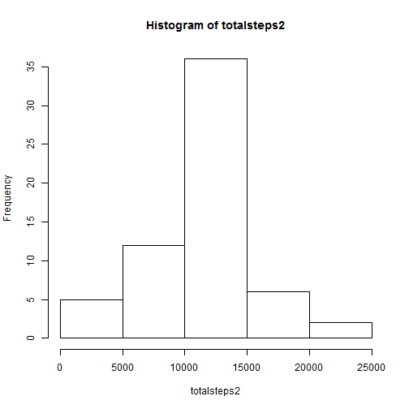
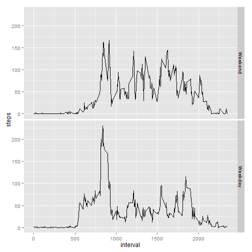

# Reproducible Research: Peer Assessment 1


## Loading and preprocessing the data
This code loads the data from file and converts the date column into Date data.

```r
data <- read.csv("activity.csv", na.strings = "NA")
data$date <- as.Date(data$date)
```

## What is mean total number of steps taken per day?
Sapply is used to calculate the sum of steps split by date. Histogram, mean,
and median are shown as well.

```r
totalsteps <- sapply(split(data$steps,data$date),sum, na.rm=T)
hist(totalsteps)
```

 

```r
mean(totalsteps)
```

```
## [1] 9354
```

```r
median(totalsteps)
```

```
## [1] 10395
```

## What is the average daily activity pattern?
Using the plyr package, the step data is summarized by interval and plotted 
using the ggplot2 package. The daily interval where the maximum number of 
average steps is also reported.

```r
library(plyr)
library(ggplot2)
daily <- ddply(data, "interval", summarise, steps = mean(steps, na.rm=T))
qplot(interval, steps, data = daily, geom = "line")
```

 

```r
daily$interval[which.max(daily$steps)]
```

```
## [1] 835
```

## Imputing missing values
The number of missing data is shown below. Missing values were imputed by
using the mean step data per interval over all days. A histogram of the
post-processed data is shown. The mean steps per day has increased, as well as
the median, implying that the imact of imputing missing data on the estimates
of total daily number of steps increases said number.

```r
length(data$steps) - length(na.omit(data$steps))
```

```
## [1] 2304
```

```r
empty <- which(is.na(data$steps)) ## row numbers where steps is empty
data2 <- data ## creates new dataset

for (i in 1:length(empty)) {
        data2$steps[empty[i]] <- daily$steps[daily$interval == data$interval[empty[i]]]
}

totalsteps2 <- sapply(split(data2$steps,data2$date),sum, na.rm=T)
hist(totalsteps2)
```

 

```r
mean(totalsteps2)
```

```
## [1] 10766
```

```r
median(totalsteps2)
```

```
## [1] 10766
```

## Are there differences in activity patterns between weekdays and weekends?
Weekends and weekdays were split using the weekdays() function. The average
steps by interval were calculated, split between weekend and weekday. Both 
sets of data are plotted below. 

```r
data2$weekday <- (weekdays(data2$date) != "Saturday" 
                  & weekdays(data2$date) != "Sunday")
data2$weekday <- factor(data2$weekday, labels = c("Weekend", "Weekday"))

daily2 <- ddply(data2, c("interval", "weekday"), summarise, steps = mean(steps))
g <- ggplot(daily2, aes(interval, steps))
g + geom_line() + facet_grid(weekday~.)
```

 
